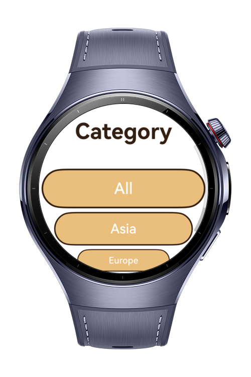
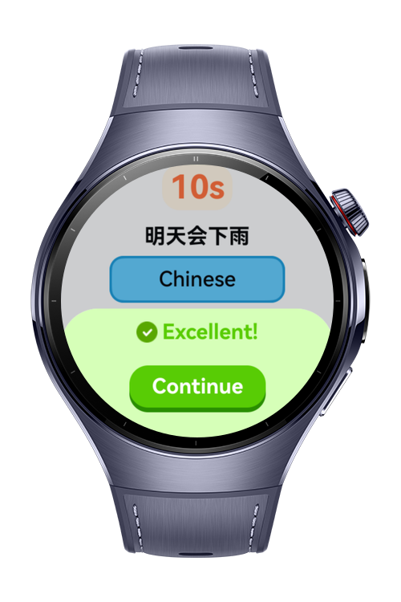
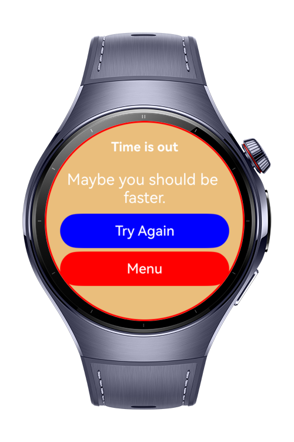

# Guess The Language

`guess-the-language` is a HarmonyOS wearable quiz app where players choose a continent, identify languages under a countdown, and review their weekly score history.

# Preview

<div align="center">
  
  
  
  
</div>

# Use Cases

- Choose a continent and start a timed language guessing round.
- Load question data from `rawfile/questions.json`.
- Shuffle the question list before each round.
- Play audio feedback for correct, incorrect, and completion states.
- Track seven-day averages for score and answer percentage.

# Tech Stack

- ArkTS
- ArkUI
- HarmonyOS SDK `6.0.0(20)`
- DevEco Studio `6.0.0`
- `@kit.ArkUI`
- `@kit.AbilityKit`
- `@kit.BasicServicesKit`
- `@kit.PerformanceAnalysisKit`
- `@kit.MediaKit`
- `@kit.AudioKit`

# Constraints and Restrictions

- Target device: Huawei Watch 5.
- Build and test flow is designed for DevEco Studio and Hvigor.
- Navigation uses `Navigation` and `NavPathStack`; Router APIs are not used.

# Project Structure

```text
AppScope/
├── app.json5
└── resources/
    └── base/
        ├── element/
        │   └── string.json
        └── media/
            ├── background.png
            ├── foreground.png
            └── layered_image.json

entry/
├── build-profile.json5
├── hvigorfile.ts
├── obfuscation-rules.txt
├── oh-package.json5
└── src/
    ├── main/
    │   ├── module.json5
    │   ├── ets/
    │   │   ├── components/
    │   │   │   ├── CustomButton.ets
    │   │   │   ├── CustomText.ets
    │   │   │   ├── NavButton.ets
    │   │   │   ├── playAudio.ets
    │   │   │   └── QuestionOptions.ets
    │   │   ├── entryability/
    │   │   │   └── EntryAbility.ets
    │   │   ├── entrybackupability/
    │   │   │   └── EntryBackupAbility.ets
    │   │   ├── model/
    │   │   │   ├── Question.ets
    │   │   │   └── Score.ets
    │   │   ├── pages/
    │   │   │   ├── ContinentChooseScreen.ets
    │   │   │   ├── HowToScreen.ets
    │   │   │   ├── Index.ets
    │   │   │   ├── MainScreen.ets
    │   │   │   ├── QuizScreen.ets
    │   │   │   ├── ScoreScreen.ets
    │   │   │   └── StatsScreen.ets
    │   │   ├── utils/
    │   │   │   ├── QuestionLoader.ets
    │   │   │   ├── ScoreStorage.ets
    │   │   │   └── ShuffleList.ets
    │   │   └── viewmodel/
    │   └── resources/
    │       ├── base/
    │       │   ├── element/
    │       │   │   ├── color.json
    │       │   │   ├── float.json
    │       │   │   └── string.json
    │       │   ├── media/
    │       │   │   ├── background.png
    │       │   │   ├── correct.png
    │       │   │   ├── foreground.png
    │       │   │   ├── high_score_img.png
    │       │   │   ├── incorrect.png
    │       │   │   ├── layered_image.json
    │       │   │   ├── low_score_img.png
    │       │   │   ├── mid_score_img.png
    │       │   │   └── startIcon.png
    │       │   └── profile/
    │       │       ├── backup_config.json
    │       │       └── main_pages.json
    │       ├── dark/
    │       │   └── element/
    │       │       └── color.json
    │       └── rawfile/
    │           ├── correct_answer.mp3
    │           ├── NotoSansDevanagari_VariableFont.ttf
    │           ├── questions.json
    │           ├── quiz_complete.mp3
    │           └── wrong_answer.mp3
    ├── mock/
    │   └── mock-config.json5
    ├── ohosTest/
    │   ├── ets/
    │   └── module.json5
    └── test/
        ├── List.test.ets
        └── LocalUnit.test.ets

screenshots/
├── 1.gif
├── 2.png
├── 3.png
└── 4.png
```

# License

Guess The Language is distributed under the terms of the MIT License. See [LICENSE](./LICENSE) for details.
